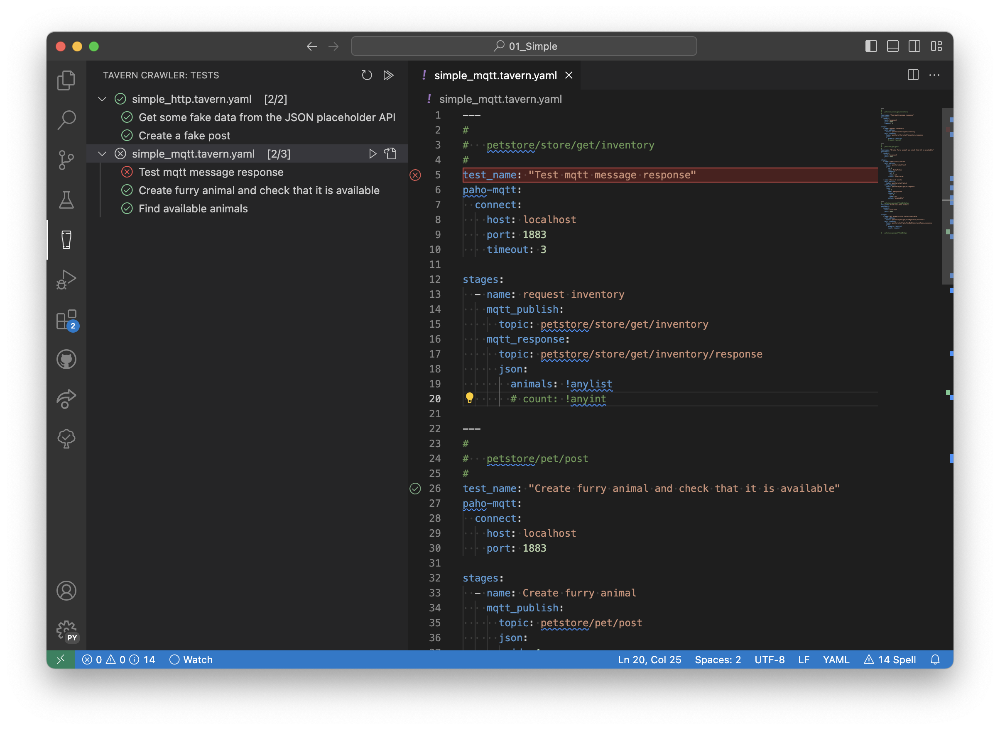

# Tavern Crawler

A Visual Studio Code extension to enable faster writing of [Tavern](https://tavern.readthedocs.io/en/latest/index.html) tests.

## Philosophy
Tavern Crawler philisopy is file first. Like Tavern, it doesn't aim to be a replacement of applications such as Postman an Insomnia. Rather, the focus is to enable the user to write tests faster and minimize the effort while doing so.
To enable the user to get started quickly, it adopts a format similar to VSCode's Test window. This enables quick assessment of tests results, while enalbing quick navigation through the Tavern test files.

## Features available:
- Run tests directly from the tests tree
- Tests errors reported in the editor
- Insert HTTP and MQTT snippets (snippets available `tavern-http-test`,`tavern-http-stage`,`tavern-mqtt-test`,`tavern-mqtt-publish`,`tavern-mqtt-reply`)
- Import OpenAPI specifications using the command "`Import OpenAPI from URL`"
